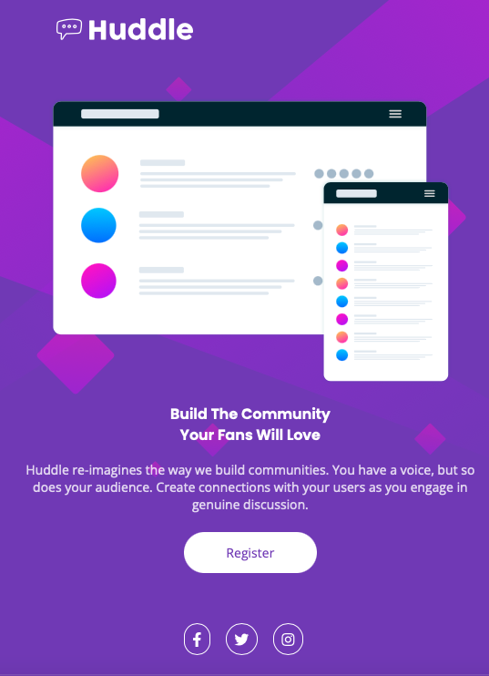

<h1>Frontend Mentor Quest Huddle</h1>

<h2>Este é um exercício do Frontend Mentor para criação de uma landing page em formato desktop e formato mobile.</h2> 

 

- CAPTURA DE TELA VERSÃO DESKTOP

 
 

- CAPTURA DE TELA VERSÃO MOBILE

## TECNOLOGIAS UTILIZADAS

- HTML5
- CSS

## AUTOR
@renansegabinazzi